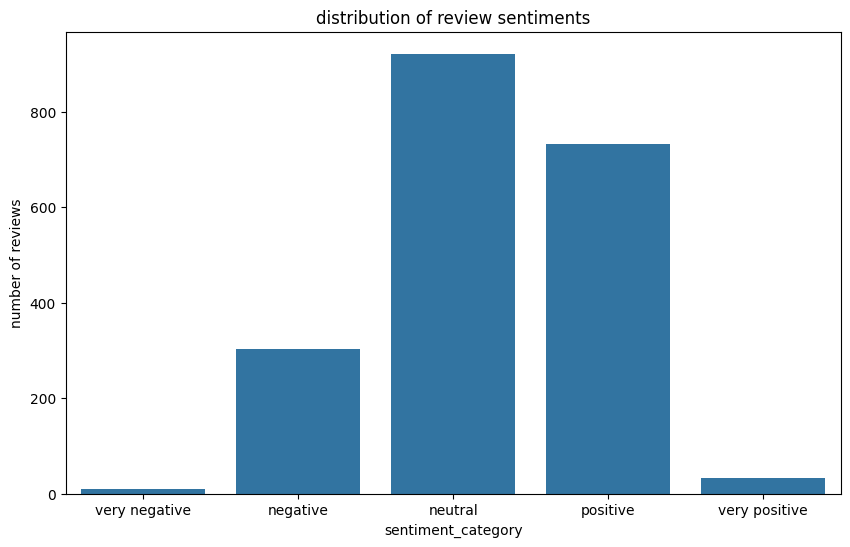

# ✈️ British Airways Customer Reviews Analysis

---

## Project Overview

This project analyzes customer reviews of **British Airways**, scraped from Skytrax (airlinequality.com). Using natural language processing and data visualization techniques, it provides insights into customer satisfaction, complaint trends, and the overall sentiment toward the airline’s services.

---

## Folder Structure

|- BA_reviews.csv                                 # Raw scraped review data
|- British_airways_reviews_analysis.ipynb         # Jupyter notebook with full analysis
|- requirements.txt                               # Python dependencies
|- README.md                                      # This documentation file

---

## Key Features

-  **Web Scraping**: Collected 1,000+ authentic customer reviews using BeautifulSoup.
-  **Sentiment Analysis**: Identified positive, negative, and neutral sentiments in reviews using TextBlob.
-  **Complaint Categorization**: Extracted and grouped recurring complaints: service, flight delays, food, comfort, etc.
-  **Trend Analysis**: Evaluated average ratings over time to spot service quality trends.
-  **Feature Importance**: Ranked the most influential factors on customer satisfaction.

---

## ⚙️ How to Use

### 1. Clone the Repository

```bash
git clone https://github.com/your-username/british-airways-review-analysis.git
cd british-airways-review-analysis
```
2. Install Dependencies
Make sure you have Python 3.8+ installed.

Required libraries:

pandas
numpy
matplotlib
seaborn
beautifulsoup4
requests
textblob

3. Run the Notebook
Launch Jupyter and open the analysis:
---

##  Key Findings

###  Top Complaint Areas

| Complaint Type       | Share of Complaints |
|----------------------|--------------------:|
| Staff Service        | 31%                 |
| Flight Operations    | 28%                 | 
| Cabin Comfort        | 20%                 | 
| Food Quality         | 15%                 | 

###  Sentiment Distribution


| Sentiment Category  | Percentage | 
|---------------------|-----------:|
| Very Negative       | 0.50%      | 
| Negative            | 15.15%     | 
| Neutral             | 46.10%     | 
| Positive            | 36.60%     | 
| Very Positive       | 1.65%      | 


---
## Random Forest Feature Importance Results

### Feature Importance Analysis


###  Key Observations

- **X-axis**: Displays input features used in the model.
- **Y-axis**: Shows the importance score of each feature.
- The taller the bar, the more important the feature is in influencing the model’s decision.

---

###  Top 3 Most Important Features:

1. **`length_of_stay`** – Most influential feature in the dataset.
2. **`flight_duration`** – Very closely ranked to `length_of_stay`.
3. **`purchase_lead`** – Days between booking and the flight date.

---

###  Least Important Features:

- `wants_in_flight_meals`
- `wants_preferred_seat`
- `sales_channel`

These features contributed the least to the model and may be optional in a simplified version.

---

### Business Implications

1. **Booking Timing Matters**:
   - Purchase lead time is the strong predictor, suggesting early planners behave differently
   - Consider targeted marketing based on booking windows

2. **Flight Characteristics**:
   - Flight duration significantly impacts outcomes
   - Short-haul vs long-haul passengers have different behaviors

